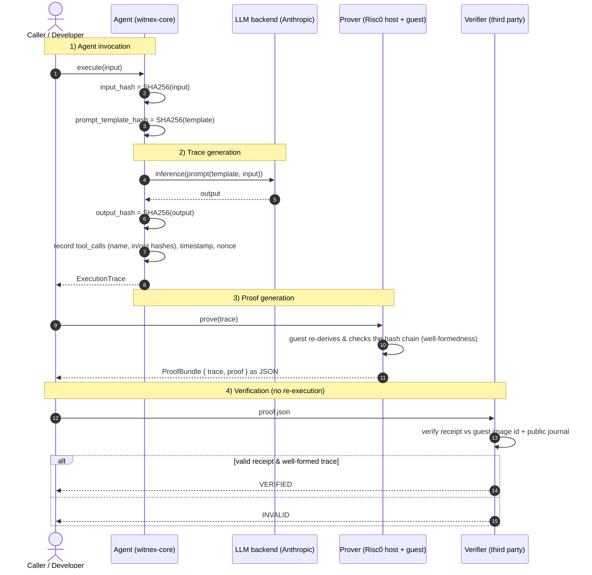

# Witnex Architecture

> Phase 1. Types and end-to-end flow only — no proving logic is implemented yet.

Witnex turns each agent execution into a **tamper-evident commitment** and a
**ZK proof** that the commitment is well-formed, so a third party can verify
*what the agent did* without re-running it and without seeing the underlying
plaintext.

## What is proven (and what is not)

| Property | Proven in Phase 1? |
|----------|--------------------|
| The agent committed to a specific input and output (input/output integrity) | ✅ |
| Tool calls occurred in the claimed order with claimed parameters (trace integrity) | ✅ |
| The committed inputs/outputs/tool data form a consistent hash chain | ✅ |
| The LLM inference itself was *correct* | ❌ (zkML — later phase) |

A Witnex proof says *"this exact input, prompted this exact way, run against this
named model, produced this exact output, via this exact sequence of tool calls."*
It does **not** say the output is the right answer.

## Components

| Component | Crate / package | Role |
|-----------|-----------------|------|
| Agent runtime + trace recorder | `witnex-core` | Defines `Agent`, `ExecutionTrace`, `ToolCall` and supporting commitment types. |
| Prover | `witnex-prover` | Risc0 zkVM host + guest; proves a trace well-formed. |
| Verifier | `witnex-verifier` | Standalone verification of a `ProofBundle`. |
| Demo CLI | `witnex-cli` | `witnex demo summarize` / `witnex verify`. |
| SDK | `@witnex/sdk` | TypeScript mirror of the trace/proof types. |

## End-to-end sequence

## Trust model

- The verifier trusts the **Risc0 proof system** and the published **guest image
  id**, nothing else about the prover.
- The verifier does **not** trust the agent's host, network, or LLM provider.
- Timestamps and the model id are *committed*, not *proven honest* — a dishonest
  agent can still claim a wrong clock or a wrong model; what it cannot do is
  alter the input/output/tool-call commitments after the fact.

## Status & next steps

- [x] Prompt 1 — workspace scaffold, core types, this document.
- [ ] Prompt 2 — implement the `witnex demo summarize` / `witnex verify` slice
      with a minimal Risc0 hash-chain guest and a mocked-LLM integration test.
